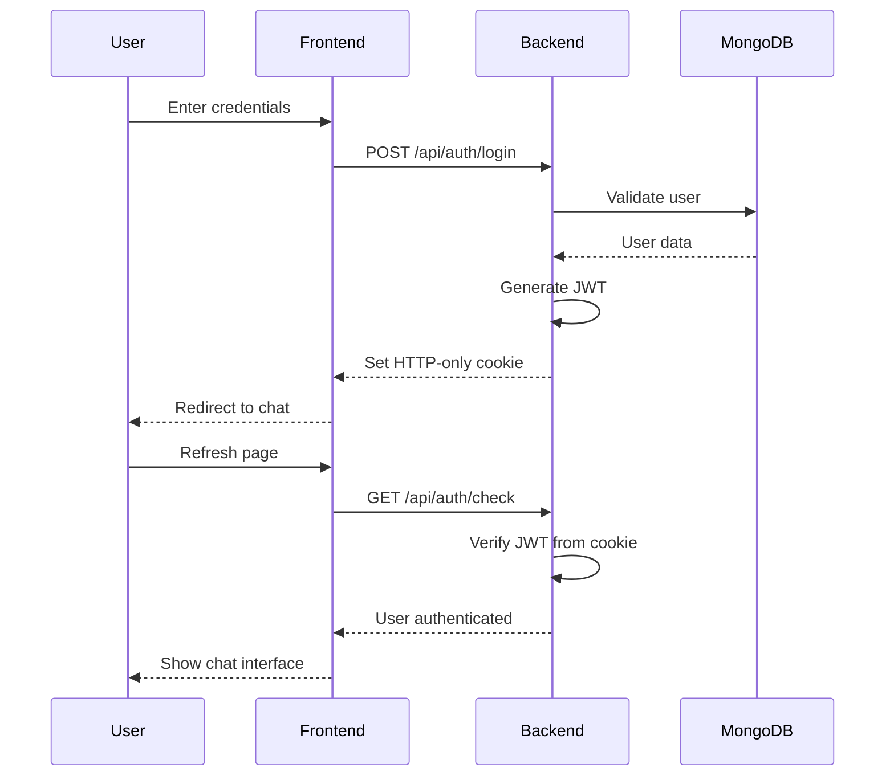

<div align="center">

<p align="center">
  
</p>

# 💬 Real-Time Chat Application

**A modern real-time chat application built with React, Node.js, Express, MongoDB, Socket.IO, and Tailwind CSS**

[](https://reactjs.org/)
[](https://nodejs.org/)
[](https://www.mongodb.com/)
[](https://socket.io/)
[](./LICENSE)

<p align="center">
  Supports secure authentication, real-time messaging, online status tracking, profile management, and theme customization
</p>

</div>

```diff
+ ──────────────────────────────────────────────────────────────────────────────
```

## 🚀 Features

<div align="center">

| 🎯 Feature | 📝 Description |
|------------|---------------|
| 🔐 **JWT Authentication** | Secure Signup / Login / Logout system |
| 💬 **Real-time Messaging** | Instant messaging powered by Socket.IO |
| 🟢 **Online Status** | Live online/offline user tracking |
| 🖼️ **Image Sharing** | Share images directly in chat |
| 👤 **User Profiles** | Customizable profiles with avatar upload |
| 🎨 **Theme Switching** | Multiple DaisyUI theme options |
| 🍪 **Cookie Auth** | Secure cookie-based authentication |
| 📱 **Responsive Design** | Optimized for mobile & desktop |
| ⚡ **Lightning Fast** | Powered by Vite for instant feedback |

</div>

```diff
+ ──────────────────────────────────────────────────────────────────────────────
```

## 🛠️ Tech Stack

### 🎨 Frontend

<table>
<tr>
<td width="50%">

**Core Technologies**
- ⚛️ React (Vite)
- 🎨 Tailwind CSS
- 🌼 DaisyUI
- 🐻 Zustand (state management)

</td>
<td width="50%">

**Libraries & Tools**
- 📡 Axios
- 🔌 Socket.IO Client
- 🚀 Vite Dev Server
- 📦 Modern ES6+ JavaScript

</td>
</tr>
</table>

### ⚙️ Backend

<table>
<tr>
<td width="50%">

**Server & Database**
- 🟢 Node.js
- 🚂 Express.js
- 🍃 MongoDB + Mongoose
- 🔐 JWT (JSON Web Tokens)

</td>
<td width="50%">

**Features & Services**
- 🔌 Socket.IO
- ☁️ Cloudinary (image uploads)
- 🌐 CORS & Cookie Parser
- 🔒 Secure Authentication

</td>
</tr>
</table>

```diff
+ ──────────────────────────────────────────────────────────────────────────────
```

## 📂 Project Structure

```
RealChat/
│
├── 📂 backend/
│   ├── 📂 src/
│   │   ├── 📂 controllers/      # Request handlers
│   │   ├── 📂 routes/           # API routes
│   │   ├── 📂 models/           # MongoDB schemas
│   │   ├── 📂 lib/              # Utility functions
│   │   └── index.js             # Server entry point
│   ├── .env                     # Environment variables
│   └── package.json
│
├── 📂 frontend/
│   ├── 📂 src/
│   │   ├── 📂 components/       # React components
│   │   ├── 📂 pages/            # Page components
│   │   ├── 📂 store/            # Zustand stores
│   │   ├── 📂 lib/              # Utilities
│   │   └── main.jsx             # React entry point
│   ├── index.html
│   └── package.json
│
└── README.md
```

```diff
+ ──────────────────────────────────────────────────────────────────────────────
```

## ⚙️ Environment Variables

Create a `.env` file inside the **backend** folder:

```env
PORT=5001
MONGODB_URI=mongodb://127.0.0.1:27017/realchat
JWT_SECRET=your_jwt_secret_key_here
NODE_ENV=development
CLOUDINARY_CLOUD_NAME=your_cloudinary_name
CLOUDINARY_API_KEY=your_cloudinary_key
CLOUDINARY_API_SECRET=your_cloudinary_secret
```

> ⚠️ **Security Note:** Never commit your `.env` file to version control!

```diff
+ ──────────────────────────────────────────────────────────────────────────────
```

## ▶️ Getting Started

### Prerequisites

```bash
✓ Node.js v18 or higher
✓ MongoDB installed and running
✓ npm or yarn package manager
```

### 1️⃣ Clone the repository

```bash
git clone https://github.com/Akshatsrii/Real-Time-Chat.git
cd Real-Time-Chat
```

### 2️⃣ Install dependencies

**Backend**

```bash
cd backend
npm install
npm run dev
```

**Frontend**

```bash
cd frontend
npm install
npm run dev
```

### 3️⃣ Start MongoDB

```bash
# Make sure MongoDB is running on your system
mongod
```

```diff
+ ──────────────────────────────────────────────────────────────────────────────
```

## 🌐 Application URLs

<div align="center">

| Service | URL | Description |
|---------|-----|-------------|
| 🎨 **Frontend** | `http://localhost:5173` | React application |
| ⚙️ **Backend API** | `http://localhost:5001` | Express server |
| 🍃 **MongoDB** | `mongodb://127.0.0.1:27017` | Database |

</div>

```diff
+ ──────────────────────────────────────────────────────────────────────────────
```

## 🔒 Authentication Flow



### 🔑 Key Security Features

- ✅ JWT tokens stored in **HTTP-only cookies** (XSS protection)
- ✅ Automatic authentication check on page refresh
- ✅ Protected routes for authenticated users only
- ✅ Secure password hashing
- ✅ CORS configured for specific origins


```diff
+ ──────────────────────────────────────────────────────────────────────────────
```

## 🎯 API Endpoints

### Authentication Routes

```javascript
POST   /api/auth/signup      // Register new user
POST   /api/auth/login       // Login user
POST   /api/auth/logout      // Logout user
GET    /api/auth/check       // Verify authentication
```

### Message Routes

```javascript
GET    /api/messages/:userId // Get messages with specific user
POST   /api/messages/send    // Send a new message
```

### User Routes

```javascript
GET    /api/users            // Get all users
PUT    /api/users/profile    // Update user profile
POST   /api/users/avatar     // Upload avatar image
```

```diff
+ ──────────────────────────────────────────────────────────────────────────────
```

## 🚀 Socket.IO Events

### Client → Server

```javascript
"setup"           // Initialize socket connection
"join_room"       // Join a chat room
"send_message"    // Send a message
"typing"          // User is typing
"stop_typing"     // User stopped typing
```

### Server → Client

```javascript
"user_connected"   // User came online
"user_disconnected" // User went offline
"message_received" // New message received
"typing_indicator" // Someone is typing
```

```diff
+ ──────────────────────────────────────────────────────────────────────────────
```

## 📌 Future Improvements

<div align="center">

| Status | Feature | Description |
|--------|---------|-------------|
| 📋 | **Message Read Receipts** | Show when messages are read |
| 👥 | **Group Chats** | Create and manage group conversations |
| ⌨️ | **Typing Indicators** | Real-time typing status |
| 😊 | **Message Reactions** | React to messages with emojis |
| 🔔 | **Push Notifications** | Desktop & mobile notifications |
| 🔍 | **Message Search** | Search through chat history |
| 📎 | **File Sharing** | Share documents and files |
| 🎤 | **Voice Messages** | Record and send voice notes |
| 📞 | **Voice/Video Calls** | WebRTC integration |
| 🌙 | **Dark Mode** | System-based theme detection |

</div>

```diff
+ ──────────────────────────────────────────────────────────────────────────────
```


<div align="center">

<p align="center">
  
</p>

[](https://github.com/Akshatsrii/Real-Time-Chat/stargazers)
[](https://github.com/Akshatsrii/Real-Time-Chat/network/members)


</div>
